---
format:
  revealjs:
    self-contained: true
    spotlight: true
    touch: true
    controls: true
    pointer: true
    center-title-slide: false
    transition: fade
    transition-speed: fast
    scrollable: true
    slide-number: true
    incremental: false
    multiplex: false
    chalkboard: false
    theme: [custom.scss]
    filters:
     - highlight-text
bibliography: references-febrile.bib
lightbox: true
csl: diagnostic-microbiology-and-infectious-disease.csl
---

# Febrile Neutropenia {background-color="#b20e10"}

 

{fig-align="center" width="350"}

**Russell E. Lewis**   Associate Professor of Infectious Diseases   Department of Molecular Medicine, University of Padua

   

 russelledward.lewis\@unipd.it    [https://github.com/Russlewisbo](https://github.com/Russlewisbo/ESCMID_2022_talk)   Slides and course materials: [www.padovaid.com](https://padovaid.com/)

## Objectives

 

- What are the most common infections associated with short versus prolonged neutropenia?

- How does the presentation of skin, mucocutaneous lesions, abdominal pain or pneumonia change the infection differential diagnosis?

- What are common empiric antimicrobial regimens used to treat patients while awaiting diagnostic results?

## Normal hematopoiesis

 

::::: columns
::: {.column width="50%"}
{fig-align="center"}
:::

::: {.column width="50%"}
- **Myeloid lineage (neutrophils / platelets)**

  - Homogeneous, terminally differentiated effector cells
  - Short-lived, post-mitotic
  - Continuous high-throughput production
  - Rapid quantitative recovery after chemotherapy (≈2–3 weeks)

- **Lymphoid lineage (T, B, NK cells)**

  - Highly heterogeneous populations
  - Mix of short-lived effector cells and long-lived memory cells
:::
:::::

## Chemotherapy-associated neutropenia

 

- **Antineoplastic chemotherapy impairs proliferation of normal hematopoietic progenitor cells**

  - Obliteration of the mitotic pool

  - Depletion of the marrow reserve

- **Antineoplastic drugs, glucocorticoids and irradiation also interfere with the function of non-proliferating granulocytes, resulting in:**

  - Decreased chemotaxis

  - Diminished phagocytic capacity

  - Defective intracellular killing

## Corticosteroids

 

::::: columns
::: {.column width="50%"}
**Paradoxical effects:**

- ↑ Granulocytopoiesis (apparent benefit)
  - ↓ Accumulation at infection site
- ↓ Adherent capacity
- ↓ Chemotaxis
- ↓ Phagocytosis
- ↓ Intracellular killing
:::

::: {.column width="50%"}

:::
:::::

::: aside
[@chastainUnintendedConsequencesRisk2023]
:::

## Immunity and innate immune cells

 

+--------------------------------+--------------------------------------------------+-------------------------------------------------+
| Cells                          | Molecules                                        | Active against                                  |
+================================+==================================================+=================================================+
| **PMNs**                       |                                               | Bacteria, fungi                                 |
|                                |                                                  |                                                 |
| - 1° granules                  | - Lysozyme, myeloperoxidase with (with H~2~O~2)~ |                                                 |
|                                |                                                  |                                                 |
| - Specific granules            | - Defensins, BPI, lactoferrin                    |                                                 |
+--------------------------------+--------------------------------------------------+-------------------------------------------------+
| **Macrophages**                | - Similar to PMN but no myeloperoxidase          | Intracellular pathogens  (depletes arginine) |
|                                |                                                  |                                                 |
|                                | - Nitric oxide                                   |                                                 |
|                                |                                                  |                                                 |
|                                | - Arginase                                       |                                                 |
+--------------------------------+--------------------------------------------------+-------------------------------------------------+
| **Eosinophils**                | - Cationic proteins                              | Worms (extracellular)                           |
|                                |                                                  |                                                 |
|                                | - Major basic protein                            |                                                 |
|                                |                                                  |                                                 |
|                                | - Peroxidase                                     |                                                 |
+--------------------------------+--------------------------------------------------+-------------------------------------------------+
| **Natural killing (NK) cells** | - Perforins                                      | Viral or bacterial infected cells               |
|                                |                                                  |                                                 |
|                                | - Granzymes                                      |                                                 |
+--------------------------------+--------------------------------------------------+-------------------------------------------------+

## Quantitative relationship of neutropenia   with infection risk

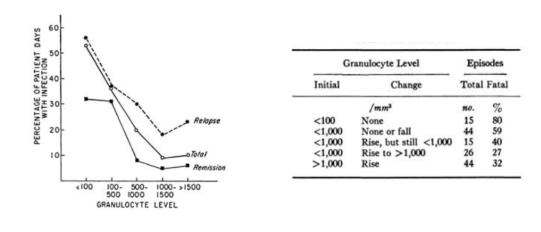

::: aside
[@geraldp.bodey1966]
:::

## Absolute neutrophil count

 

$$\text{ANC} = \text{WBC} \times \frac{(\%\ \text{neutrophils} + \%\ \text{bands})}{100}$$

   

| **ANC (cells/µL)** | **Interpretation** | **Clinical relevance**          |
|--------------------|--------------------|---------------------------------|
| 1000–1500          | Mild neutropenia   | Usually low risk                |
| 500–1000           | Moderate           | Increased infection risk        |
| **\<500**          | Severe neutropenia | High risk of serious infections |
| **\<100**          | Profound           | Extremely high risk             |

::: aside
- The ANC correlates directly with risk of bacterial and fungal infections
- Below 500/µL, endogenous flora becomes dangerous (gut, skin)
- Below 100/µL, risk becomes very high, especially with prolonged duration
:::

## Granulocytes (neutrophils)

 

- Chemotherapy & radiation → **neutropenia**
- Duration: Nadir 10-14 days, duration 3-4 weeks or longer
- **Primary risk factor for bacterial and fungal infections**
- Risk of infection increases with:
  - Depth of neutropenia
  - Duration of neutropenia
  - Concurrent organ dysfunction

## Risk by disease type

   

| Disease                           | Risk Level |
|-----------------------------------|------------|
| Acute myeloid leukemia            | Highest    |
| High-risk ALL, Relapsing leukemia | High       |
| Low-risk ALL, CLL, Myeloma        | Moderate   |
| Non-Hodgkin lymphoma              | Lower      |
| Solid tumors                      | Lowest     |

   

::: aside
ALL- aculte lymphoblastic leukemia,   CLL- chonic lymphoblastic leukemia
:::

::: notes
Risk correlates with intensity of antineoplastic therapy. Children generally have lower infection risk than adults.
:::

## Clinical signs of infection are muted   in neutropenic patients

 

% of patients who have a neutrophil count/mm^3^ :

 

|                           |           |              |            |
|---------------------------|-----------|--------------|------------|
| **Signs and Symptoms**    | **\<100** | **101-1000** | **\>1000** |
| **Fever**                 | 98        | 90           | 76         |
| **Fluctuance**            | 6         | 36           | 52         |
| **Fissure or ulceration** | 21        | 42           | 54         |
| **Exudate**               | 11        | 64           | 91         |
| **Purulent sputum**       | 8         | 67           | 84         |
| **Pyuria**                | 11        | 63           | 97         |

::: aside
[@sickles1975]
:::

## The integument

::::: columns
::: {.column width="50%"}
**Skin:**

- Chemotherapy → hair loss, dryness
- Catheters → direct microbial access
- Broken skin → *S. aureus*, gram-negatives

**Oropharynx:**

- Xerostomia + antibiotics → thrush, bacterial overgrowth
:::

::: {.column width="50%"}
{width="1200"}
:::
:::::

::: aside
[@Coppola20201]
:::

## Alimentary Tract

 

- **Microbiome disruption** → *Clostridioides difficile*
- **Mucosal barrier injury** from chemotherapy
- Facilitates bacterial translocation
- Neutropenia allows progression to sepsis

## Chemotherapy-associated dysbiosis

{fig-align="center"}

::: aside
image:www.biorender.com
:::

## Model of mucosal barrier injury

{fig-align="center"}

::: aside
[@basile2019]
:::

## Mucositis

WHO oral toxicity scale

{fig-align="center"}

## Which pathogens translocate?

{fig-align="center"}

## Most common bacterial pathogens

::::: columns
::: {.column width="50%"}
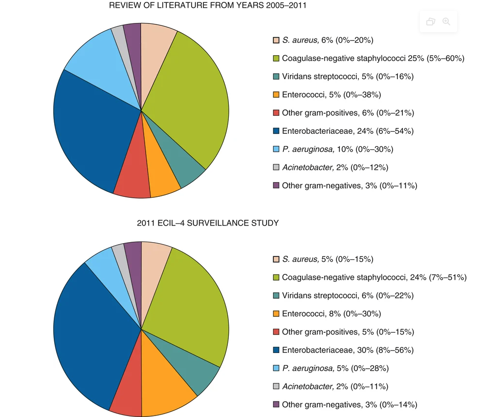{width="600"}
:::

::: {.column width="50%"}
     

- Infectious source documented in only 20-30% of episodes
- Bacteremia documented in 10-25% of patients *with fever*
- Aerobic Gram-positive and Gram-negative
:::
:::::

::: aside
[@mikulskaAetiologyResistanceBacteraemias2014]
:::

## Sequence of infection

{fig-align="center" width="800"}

## Risk of infection vs. duration of neutropenia

   

:::::: columns
::: {.column width="33%"}
**Phase I (1-10 days)**  

- CONS - Staphylococcus spp.

- Enterobacterales

- Viridans streptococci

- Anaerobes

- Enterococcus

- Clostroides diffile

 

- Herpes simplex

- +/- Candida spp.
:::

::: {.column width="33%"}
**Phase II** **(10-27 days)**

- Phase I pathogens *plus*

- Methicillin-resistant S. aures (MRSA)

- Vancomycin-resistant Enterococcus (VRE)

- Resistant gram-negative bacteria

- *Stenotrophomonas maltophilia*

 

- Herpes simplex
- +/- Candida spp.
:::

::: {.column width="33%"}
**Phase III (\> 27 days)**

- Phase I&II pathogens, *plus* + Invasive molds
:::
::::::

## Invasive pulmonary aspergillosis risk vs. neutropenia

 

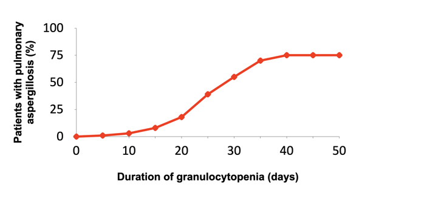{fig-align="center"}

::: aside
[@gerson1984]
:::

## Non-neutropenic risk factors

 

- **Mucositis** - Barrier disruption, translocation

- **Central venous catheters** - Entry point for pathogens

- **Microbiome alterations** - Chemotherapy-induced dysbiosis

- **Immunosuppressive drugs** - T-cell depletion

- **Biologic agents** - Targeted immune effects

## CVC-related infection rates

| Catheter Type |   | Per 100 devices | Per 1000 catheter-days |
|----|----|----|----|
| **Hickman/Broviac** | {width="100"} | 22.5 | 1.6 |
| **Port-a-cath** |  | 3.5-4 | 0.1 |
| **PICC** | 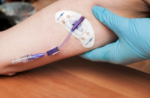{width="153"} | 3.1 | 1.1 |

::: notes
Patients with hematologic malignancies, especially acute leukemia, have higher CVC infection rates than those with solid tumors.
:::

## Example Biologic agents and infection risk

   

| Agent | Key Infections |
|----|----|
| Rituximab (anti-CD20- Bcell depletion) | HBV reactivation, PML |
| Brentuximab (anti-CD30 +lymphoma cells) | PCP, PML |
| Bortezomib   (26s proteasome inhibitor-Mantel cell lymphoma, myeloma) | VZV reactivation |
| Ruxolitinib (JAK1/2 kinase inhibitor) | VZV, TB |
| Idelalisib (P13K-delta-Bcell receptor inhibitor) | HSV, CMV, PCP |
| Ibrutinib (Bruton's tyrosine kinase-B cell receptor) | IFD (with steroids) |

::: aside
Pneumocystis (carinii) jirovecii pneumonia (PCP); VZV varicella zooster; TB tuberculosis; HSV-herpes simplex virus; CMV- cytomegalovirus; IFD- invasive fungal disease; PML-Progressive multifocal leukoencephalopathy (PML)
:::

## Impaired cell-mediated immunity increases the spectrum of possible pathogens {.smaller}

 

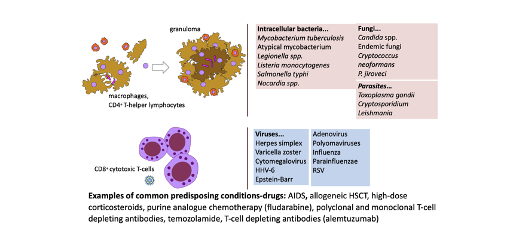{fig-align="center"} :

::: aside
*These pathogens are not covered by typical empiric regimens used for febrile neutropenia!*
:::

# Summary-Key pathogens {background-color="#b20e10"}

## Changing bacterial epidemiology

 

**Historical trend:**

- 1980s-2000s: Gram-positive predominance
- Recent: Gram-negative resurgence

**Current ratio (ECIL-4 surveillance):**

- Gram-positive: 55%
- Gram-negative: 45%

::: notes
This shift is accompanied by increasing antimicrobial resistance, making empirical therapy selection more challenging.
:::

## Resistant pathogens of concern

 

**Gram-negative:**

- ESBL-producing Enterobacterales
- Carbapenem-resistant Enterobacterales (CRE)
- *Stenotrophomonas maltophilia* (carbapenem-resistant)
- MDR *Pseudomonas aeruginosa*

**Gram-positive:**

- MRSA
- Vancomycin-resistant enterococci (VRE)

## Risk factors for resistant infections

 

1.  Previous infection/colonization with MDR organism
2.  Prior broad-spectrum antibiotic exposure
3.  Healthcare-associated infection
4.  Prolonged hospitalization
5.  Urinary catheter
6.  Older age
7.  ICU admission

## Fungal pathogens

 

::::: columns
::: {.column width="50%"}
**Most Common:**

- *Aspergillus* species (now \> *Candida* in hematology due to fluconazole prophylaxis)
- *Candida* species (increasing non-albicans)
:::

::: {.column width="50%"}
**Emerging concerns:**

- *Candida auris* - MDR, biofilm-forming
- Azole-resistant *Aspergillus fumigatus*
- *Mucorales* (increasing in some centers)
:::
:::::

::: aside
Antifungal prophylaxis impacts which pathogens are encountered. Most common presentation is nodular infiltrate on chest CT
:::

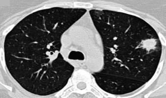{fig-align="center"}

## Breakthrough fungal infections on antifungal prophylaxis

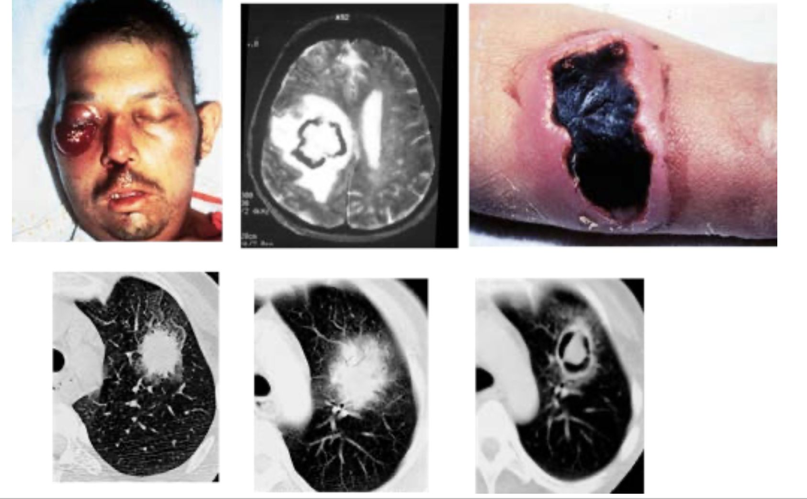{fig-align="center"}

------------------------------------------------------------------------

## Invasive aspergillosis risk

 

| Population                                           | Incidence |
|------------------------------------------------------|-----------|
| Acute myelogenous leukemia (induction)               | 7.9%      |
| Acute lymphocytic leukemia (adults)                  | 4.3-11.7% |
| Chronic myelogenous leukemia                         | 2.3%      |
| Chronic lymphocytic leukemia,   lymphoma, myeloma | \<1%      |
| Autologous HSCT                                      | 0.3-2%    |
| Allogeneic HSCT                                      | 8-15%     |

------------------------------------------------------------------------

## Viral infections

 

**Herpes viruses:**

- Herpes simplex 1&2 (HHV 1&2) reactivation: 60% of seropositive with acute leukemia
- Varicella zoster (HHV3) : Increased with bortezomib, ruxolitinib
- Epsein-barr virus (HHV4): Increased with T-cell suppression, post-transplant lymphoproliferative disorder (PTLD)
- Cytomegalovirus (HHV5): T-cell suppressing regimens- pneumonitis, colitis, hepatitis
- HHV-6: Encephalitis in transplant patients
- HHV-7:Roseola-like illness
- HHV8: Kaposi's sarcoma

**Respiratory viruses:**

- Influenza, RSV, parainfluenza
- SARS-CoV-2: High morbidity/mortality in cancer patients

# Prophylaxis strategies {background-color="#b20e10"}

## Antibacterial prophylaxis

 

**Fluoroquinolone prophylaxis:**

+--------------------------+----------------------------------------------------------+
| Pros                     | Cons                                                     |
+==========================+==========================================================+
| Reduces febrile episodes | Increasing resistance,   especially selection of ESBL |
+--------------------------+----------------------------------------------------------+
| Reduces BSI              | No consistent mortality benefit (recent data)         |
|                          |                                                          |
|                          | reduction in febrile episodes                            |
+--------------------------+----------------------------------------------------------+
| Oral administration      | Drug interactions                                        |
+--------------------------+----------------------------------------------------------+
|                          | QT prolongation, tendinopathy                            |
+--------------------------+----------------------------------------------------------+

  **Current status:** Controversial; some guidelines no longer recommend especially in centeres with high levels of resistance

::: notes
The benefit of FQ prophylaxis may no longer translate to mortality reduction because most prevented infections can be effectively treated with empirical therapy.
:::

## Antifungal prophylaxis - Key points

 

**When to use mold-active prophylaxis:**

- Anticipated IFD incidence \>8%
- AML/MDS induction chemotherapy
- High-risk ALL
- Relapsing leukemia

**Posaconazole:**

- Number needed to treat (NNT) to prevent 1 IFD: 16
- Number needed to treat (NNT) to prevent 1 death: 27

## Antifungal prophylaxis

 

| Agent | Dose | Indication |
|----|----|----|
| Fluconazole | 400 mg daily | Candidiasis risk only |
| Posaconazole tablets | 300 mg BID day 1, then 300 mg daily | AML/MDS/ BMT |
| Voriconazole | 200 mg BID | Alternative   (TDM needed) |
| Isavuconazole | 200 mg daily (after loading) | Alternative, not "approved" for prophylaxis indication |

 

Problem: Drug interactions with agents metabolized through CYP3A4. Interactions are less severe with fluconazole and isavuconazole (weak CYP3A4 inhibitors) vs. posaconazole and voriconazole (strong CYP3A4 inhibitors)

## Pneumocystis prophylaxis

 

**Patients at risk- Indications:**

- Acute lymphocytic leukemia (all ages)
- Fludarabine, alemtuzumab, idelalisib therapy (T-cell suppressing chemotherapy)
- Corticosteroids ≥10-20 mg/day × 4 weeks
- CD4 \<200/µL

**First-line:** TMP-SMX 160/800 mg 3×/week

**Alternatives:** Dapsone, atovaquone, aerosolized pentamidine

## Antiviral prophylaxis

 

**HSV/VZV:**

- Acyclovir 800 mg BID or valacyclovir 500 mg BID
- For all seropositive patients with acute leukemia
- Required with bortezomib, alemtuzumab, idelalisib

**HBV:**

- Screen all patients before chemotherapy
- Entecavir or tenofovir for HBsAg-positive
- Continue 6-18 months post-chemotherapy

## Granulocyte-colony stimulating factor (G-CSF)

 

::::: columns
::: {.column width="50%"}
**Primary prophylaxis:**

- When febrile neutropenia risk \>20%
- Based on age, comorbidities, regimen

**Secondary prophylaxis:**

- After prior neutropenic complication
- When dose reduction would compromise outcomes
:::

::: {.column width="50%"}

:::
:::::

::: notes
G-CSF acts at multiple levels of neutrophil production: it promotes proliferation and differentiation of myeloid progenitor cells committed to the granulocytic lineage, accelerates maturation through the promyelocyte → myelocyte → metamyelocyte → band → mature neutrophil stages, and shortens the transit time through the bone marrow.

G-CSF vs FQ studies show antibiotics may be equally or more effective for preventing febrile neutropenia.
:::

## Vaccination recommendations

   

| Vaccine             | Timing                    | Notes                        |
|---------------------|---------------------------|------------------------------|
| Influenza           | Annual                    | Avoid during intensive chemo |
| Pneumococcal (PCV)  | Before chemo if possible  | Better response than PPSV23  |
| SARS-CoV-2          | 3-dose primary + boosters | All patients and contacts    |
| Herpes zoster (RZV) | VZV seropositive          | Inactivated vaccine          |

::: aside
PPSV23- 23-valent pneumococcal polysaccharide vaccin
:::

# Management of febrile neutropenia {background-color="#b20e10"}

## Definition of fever

 

For starting empirical antibiotics:

- **Single temperature** ≥38.5°C (oral/axillary), OR
- **Two measurements** ≥38.0°C separated by ≥1 hour

**Also treat infection suspected with:**

- Hypothermia (\<35.5°C)
- Altered mental status
- Hypotension
- Skin/mucosal lesions

::: notes
Fever during neutropenia is a medical emergency. Any delay in antibiotic administration increases mortality.
:::

## Classification of episodes

 

1.  **Microbiologically documented with bacteremia** - Positive blood culture
2.  **Microbiologically documented without bacteremia** - Other site culture positive
3.  **Clinically documented** - Signs/symptoms without microbiologic proof
4.  **Fever of unknown origin (FUO)** - No clinical or microbiologic documentation

## Risk stratification: MASCC score

 

| Variable                              | Points |
|---------------------------------------|--------|
| Burden of illness: none/mild          | 5      |
| Burden of illness: moderate           | 3      |
| No hypotension                        | 5      |
| No COPD                               | 4      |
| Solid tumor/no prior fungal infection | 4      |
| Outpatient status                     | 3      |
| No dehydration                        | 3      |
| Age \<60 years                        | 2      |

   

**Score \>21: Low risk**

## Risk stratification: CISNE score

 

| Variable               | Points |
|------------------------|--------|
| ECOG PS ≥2             | 2      |
| Hyperglycemia stress   | 2      |
| COPD                   | 1      |
| Cardiovascular disease | 1      |
| Mucositis grade ≥2     | 1      |
| Monocytes \<200/µL     | 1      |

   

**Score ≥3: High risk** (for solid tumor patients)

## Treatment strategies

 

**Two main approaches:**

**Escalation:**

- Start narrow, broaden if needed
- For stable patients without risk of MDR pathogens

**De-escalation:**

- Start broad, narrow when microbiology results available
- For unstable patients or MDR colonization

## Escalation strategy

 

**Day 0:**

- Anti-*Pseudomonas* β-lactam monotherapy
- Piperacillin-tazobactam, cefepime, or ceftazidime

**Day 2-4 (if needed):**

- Add vancomycin if skin/catheter infection
- Add aminoglycoside and/or change to anti-pseudomonal carbapenem if septic
- Add antifungal if persistent fever

## De-escalation strategy

**Day 0:**

- Carbapenem (meropenem) ± aminoglycoside
- Or targeted therapy based on colonization

**Day 2-4:**

- De-escalate based on cultures
- Stop aminoglycoside if not needed
- Narrow spectrum if pathogen identified

## Key antibiotics for empiric treatment

 

| Drug | Adult Dose | Administration | When |
|----|----|----|----|
| Piperacillin-tazobactam | 4.5 g q6-8h | Extended/continuous infusion | Low risk of ESBL |
| Cefepime | 2 g q8h | Extended infusion | Low risk of ESBL- active at lower inoculum |
| Meropenem | 1-2 g q8h | Extended infusion (3-6h) | Higher risk of ESBL |
| Ceftazidime-avibactam | 2.5 g q8h | 2-hour infusion | Higher risk of KPC carbapenemase |
| Ceftolozane-tazobactam | 1.5-3 g q8h | 1-hour infusion | Higher risk of MDR *P. aeruginosa* |

::: aside
Extended/continuous infusion of beta-lactams improves pharmacodynamic target attainment and may improve outcomes.
:::

## Glycopeptide use (to cover MRSA)

 

::::: columns
::: {.column width="50%"}
{fig-align="center"}
:::

::: {.column width="50%"}
**Add vancomycin or alternative (daptomycin) for:**

- Suspected catheter-related infection
- Skin/soft tissue infection
- Known MRSA colonization
- Severe sepsis with hypotension
- Pneumonia (or linezolid but not daptomycin)
- Prior MRSA infection

**Stop after 48-72h** if no gram-positive pathogen identified
:::
:::::

## Duration of therapy

 

**For FUO:**

- If afebrile 48-72h + clinically stable: consider stopping
- Short courses (72h) shown safe in selected patients

**For documented infection:**

- Guided by pathogen, site, and response
- Generally until neutrophil recovery and clinical cure

# Antifungal therapy {background-color="#b20e10"}

## Empirical vs diagnostic-driven approach

 

**Empirical:**

- Start antifungal after 4-7 days persistent fever
- Traditional approach; high antifungal exposure-overtreatment of patients

**Diagnostic-driven:**

- Use biomarkers (GM, BDG) + CT imaging
- Reduces unnecessary antifungal use
- Requires good diagnostic infrastructure

::: {}
GM -galactomannan ELISA test, BDG- β-D-glucan
:::

## Diagnostic tools

 

| Test               | Target                      | Specimen      |
|--------------------|-----------------------------|---------------|
| Galactomannan (GM) | *Aspergillus*               | Serum, BAL    |
| β-D-glucan (BDG)   | Broad fungi (not Mucorales) | Serum         |
| PCR                | Species-specific            | Blood, BAL    |
| CT imaging         | Structural changes          | Chest/sinuses |

## Mucormycosis

   

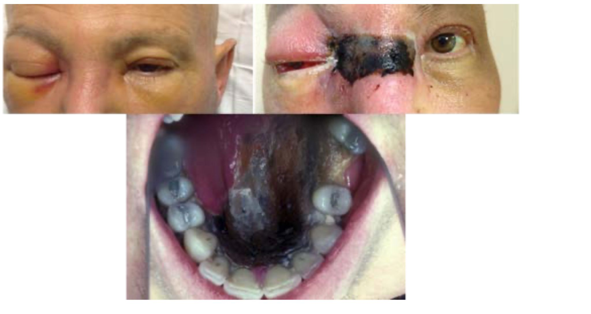{fig-align="center"}

## Antifungal Selection

 

| Indication             | First-line                              |
|------------------------|-----------------------------------------|
| Invasive aspergillosis | Voriconazole or isavuconazole           |
| Mucormycosis           | Liposomal amphotericin B                |
| Candidemia             | Echinocandin                            |
| Empirical therapy      | Liposomal amphotericin B or caspofungin |

# Specific infections {background-color="#b20e10"}

## Central venous catheter (CVC) infections

   

::::: columns
::: {.column width="50%"}
{fig-align="center"}
:::

::: {.column width="50%"}
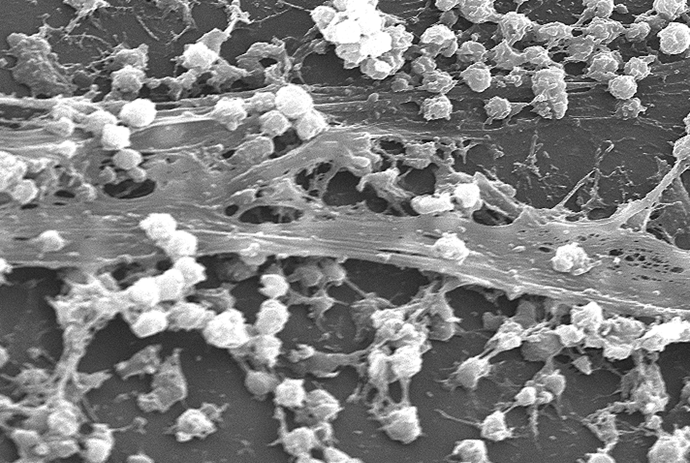
:::
:::::

## Central venous catheter (CVC) infections

 

**Management depends on:**

- Organism (CoNS vs *S. aureus* vs gram-negatives)
- Presence of tunnel/pocket infection
- Clinical stability

**Catheter removal indicated for:**

- *S. aureus*, *Candida*, *Pseudomonas* bacteremia
- Tunnel infection
- Persistent bacteremia despite antibiotic therapy

## Skin lesions

 

**Evidence of disseminated infection (hematogenous spread)**

::::: columns
::: {.column width="55%"}
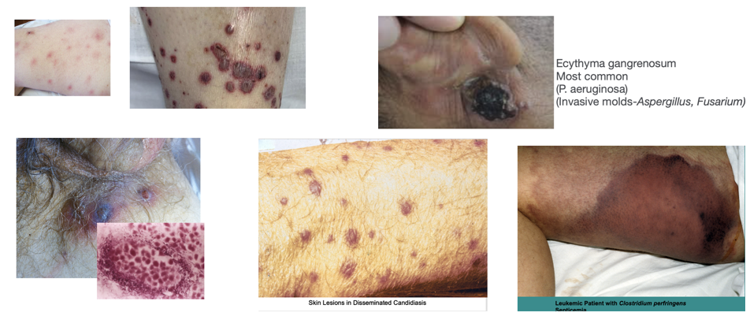
:::

::: {.column width="45%"}
**Common presentations:**

- **Ecthyma gangrenosum** — necrotic ulcer with black eschar; classic for *P. aeruginosa* or invasive molds (*Aspergillus*, *Fusarium*)
- **Disseminated papules/nodules** — *Candida*, *Fusarium*, or *Aspergillus* septate emboli
- **Leukemia cutis** — infiltration by circulating blasts
- **Intravascular hemolysis** — rapidly spreading crepitant necrosis from *Clostridium perfringens* septicemia
:::
:::::

## Ecthyma gangrenosum

 

::::: columns
::: {.column width="55%"}
**Clinical features:**

- Begins as erythematous macule → hemorrhagic bullae → **necrotic ulcer** with black eschar and erythematous halo
- Usually found on buttocks, perineum, axillae, and extremities
- May appear **without** bacteremia (direct skin inoculation)

**Most common pathogens:**

- *Pseudomonas aeruginosa* (bacteremia or local invasion)
- Invasive molds: *Aspergillus* spp., *Fusarium* spp.
- Less common: other gram-negative rods, *Stenotrophomonas*, *Candida*
:::

::: {.column width="45%"}
**Urgent evaluation:**

- **Blood cultures** × 2
- **Skin biopsy** for histopathology + bacterial, fungal, and mycobacterial cultures
- CT imaging to assess for dissemination

**Empiric management:**

- Add or broaden anti-*Pseudomonas* coverage
- Add mold-active antifungal therapy (liposomal amphotericin B or voriconazole) in high-risk patients pending biopsy results
:::
:::::

## Skin and soft tissue: treatment approach

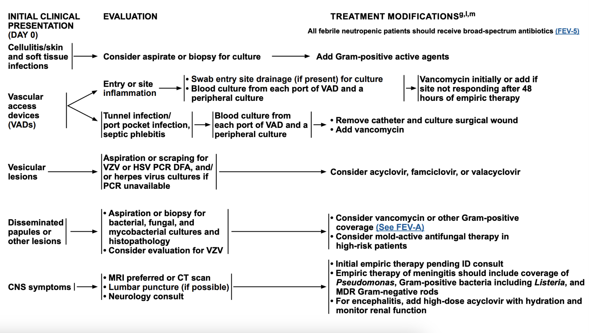{fig-align="center"}

## Oral-Upper GI infections

**Candida**- Thrush, esophagitis (odynophagia, retrosternal pain)

**Vesicular lesions**- painful grouped lesions→ulceration

**Disseminated HSV**- widespread vesicular rash , hepatitis (↑ AST/ALT, sometimes severe), pneumonitis

## Pneumonia

   

Among febrile neutropenic patients with a "normal" chest x-ray,   up to 60% of patients may have findings of pneumonia on CT

::::: columns
::: {.column width="50%"}
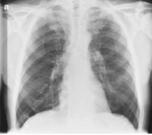{fig-align="center" width="350"}
:::

::: {.column width="50%"}
{fig-align="center" width="350"}
:::
:::::

## Common CT findings

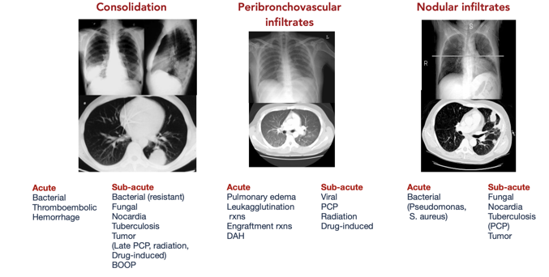{fig-align="center" width="1000"}

::: aside
PCP- pneumocystic (carinii) jirovecii pneumonia, BOOP- bronchiolitis obliterans organizing pneumonia, DAH- disseminated alveolar hemorrhage
:::

## Bronchoscopy

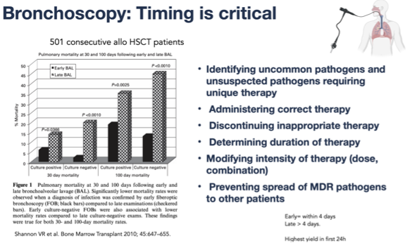{fig-align="center" width="800"}

## Neutropenic enterocolitis (typhlitis)

 

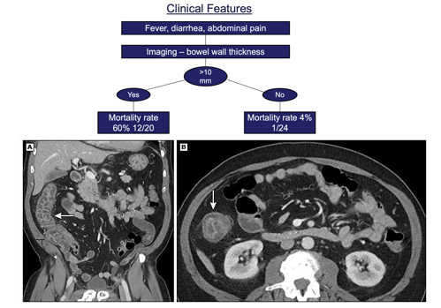{fig-align="center" width="800"}

## Neutropenic enterocolitis (typhlitis)

**Key features:**

- Fever, abdominal pain, diarrhea
- RLQ tenderness
- CT: Bowel wall thickening

**Management:**

- Broad-spectrum antibiotics including anaerobes
- Bowel rest, NG suction if obstruction
- Surgery only for perforation/hemorrhage

## *Clostridioides difficile* colitis

 

::::: columns
::: {.column width="50%"}
- **First-line treatment:** Stop unnecessary antibiotics →oral vancomycin 125 mg QID for 10 days or fidaxomicin 200 mg BID for 10 days

- **Fulminant disease:** Oral vancomycin 500 mg QID (or via NG tube) combined with IV metronidazole 500 mg TID; →consider rectal vancomycin instillation if ileus is present

- **Ongoing/worsening CDI:** Fidaxomicin if initially treated with vancomycin→ fecal microbiota transplant (if not neutropenic)

- **CDI resolved but at risk of recurrence:** Consider continuing vancomycin or fidaxomicin if diarrhea recurs, and prophylactic vancomycin during subsequent antibiotic courses → taper regimens, fecal transplant (if patient not neutropenic) or bezlotoxumab
:::

::: {.column width="50%"}
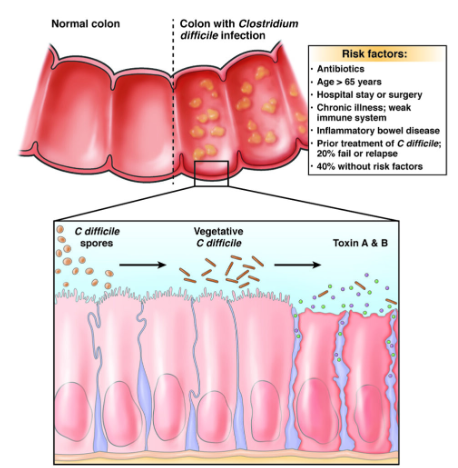{fig-align="center"}
:::
:::::

## How to assess clinical response   in febrile neutropenic patient?

 

- **Documented infection:** Treat for the appropriate duration based on the specific pathogen and site (see relevant guidelines)

  - Duration of treatment is not necessarily longer in neutropenia

- **Fever resolved, unknown origin, ANC ≥500**: Discontinue empiric antibiotics.

- **Fever resolved, unknown origin, ANC \<500:** Options include discontinuing therapy, de-escalating to prophylaxis, or continuing the current regimen until neutropenia resolves.

- **Not responding/clinically worsening:** Broaden antimicrobial coverage based on clinical and microbiologic data, obtain imaging, consider adding G-CSF, and obtain ID consultation.

- **Persistent fever ≥4 days on empiric antibiotics:** Consider adding antifungal therapy with anti-mold activity; duration guided by clinical course, neutrophil recovery

## Typical treatment duration (NCCN 2025 Guidelines) {.smaller}

<iframe src="documented_infection_therapy.html" width="100%" height="600px" style="border:none;">

</iframe>

## Causes of treatment failure

<iframe src="fail.html" width="100%" height="600px" style="border:none;">

</iframe>

# Antimicrobial stewardship {background-color="#b20e10"}

## Core components

 

1.  **Surveillance** - Resistance patterns, consumption, outcomes
2.  **Protocols** - Local guidelines for prevention and treatment
3.  **Rapid diagnostics** - Enable early de-escalation
4.  **Dose optimization** - TDM for azoles, drug interaction screening, PK/PD-guided dosing

**Requires multidisciplinary collaboration**

## Key stewardship interventions

   

- Timely de-escalation based on culture results
- Duration optimization (avoid excessive courses)
- IV to PO conversion when appropriate
- Prospective audit and feedback
- Restricted antibiotic authorization
- Education for prescribers

::: notes
Stewardship is especially important in oncology where prolonged antibiotics and prophylaxis are common.
:::

## Summary: Key takeaways

 

1.  **Neutropenia** is the primary risk factor, but many others contribute
2.  **Epidemiology** is shifting toward gram-negatives and MDR
3.  **Prophylaxis** must be tailored to risk and local epidemiology
4.  **Febrile neutropenia** requires prompt empirical therapy
5.  **Escalation vs de-escalation** strategies depend on patient risk
6.  **Antifungal therapy** can be empirical or diagnostic-driven
7.  **Stewardship** is essential to preserve antimicrobial efficacy

## References

 
