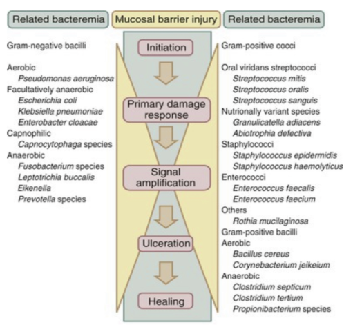
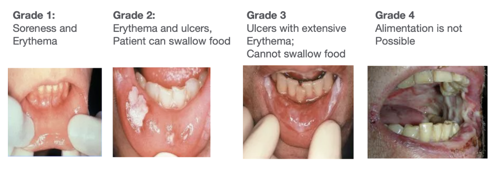
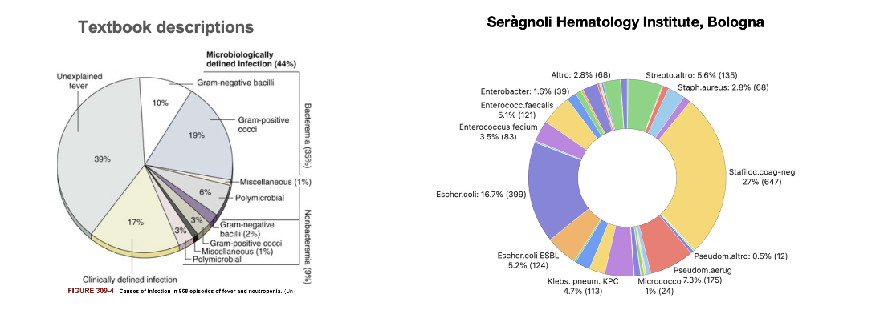

---
format:
  revealjs:
    self-contained: true
    spotlight: true
    touch: true
    controls: true
    pointer: true
    center-title-slide: false
    transition: fade
    transition-speed: fast
    scrollable: true
    slide-number: true
    incremental: false
    multiplex: false
    chalkboard: false
    theme: [custom.scss, default]
    filters:
     - highlight-text
bibliography: references.bib
lightbox: true
csl: diagnostic-microbiology-and-infectious-disease.csl
---

## Febrile neutropenia

 

**Russell E. Lewis**   Associate Professor of Infectious Diseases   Department of Molecular Medicine   University of Padua

{.absolute top="550" left="950" width="100" height="100"}

   russelledward.lewis\@unipd.it    [https://github.com/Russlewisbo](https://github.com/Russlewisbo/ESCMID_2022_talk)   Slides and course materials: [padovaid.com](https://padovaid.com/)

## Objectives

-   What are the most common infections associated with short versus prolonged neutropenia?

-   How does the presentation of skin, mucocutaneous lesions, abdominal pain or pneumonia change the infection differential diagnosis?

-   What are common empiric antimicrobial regimens used

## Normal hematopoiesis {.smaller}

 

::::: columns
::: {.column width="50%"}
{fig-align="center"}
:::

::: {.column width="50%"}
-   **Myeloid lineage (neutrophils / platelets)**

    -   Homogeneous, terminally differentiated effector cells
    -   Short-lived, post-mitotic
    -   Continuous high-throughput production
    -   Rapid quantitative recovery after chemotherapy   (≈2–3 weeks)

-   **Lymphoid lineage (T, B, NK cells)**

    -   Highly heterogeneous populations
    -   Mix of short-lived effector cells and long-lived memory cells
:::
:::::

## Chemotherapy-associated neutropenia

 

-   **Virtually all antineoplastic chemotherapy agents impair proliferation of normal hematopoietic progenitor cells**

    -   Obliteration of the mitotic pool

    -   Depletion of the marrow reserve

-   **Antineoplastic drugs, glucocorticoids and irradiation also interfere with the function of non-proliferating granulocytes, resulting in:**

    -   Decreased chemotaxis

    -   Diminished phagocytic capacity

    -   Defective intracellular killing

## Corticosteroids

**Paradoxical effects:** :::: {.columns} ::: {.column width="50%"}

::: ::: {.column width="50%"} - ↑ Granulocytopoiesis (apparent benefit) - BUT: ↓ Accumulation at infection site - ↓ Adherent capacity - ↓ Chemotaxis - ↓ Phagocytosis - ↓ Intracellular killing ::: ::::

## Immunity and innate immune cells {.smaller}

+-----------------------------------------+--------------------------------------------------------+-------------------------------------------------+
| Source                                  | Molecules                                              | Active against                                  |
+=========================================+========================================================+=================================================+
| **Polymorphonuclear leukocytes (PMNs)** | Lysozyme, myeloperoxidase, defensins, BPI, lactoferrin | Bacteria, fungi   (with H~2~O~2)~            |
|                                         |                                                        |                                                 |
| -   1 granules                          |                                                        | Bacteria, fungi                                 |
|                                         |                                                        |                                                 |
| -   Specific granules                   |                                                        |                                                 |
+-----------------------------------------+--------------------------------------------------------+-------------------------------------------------+
| **Macrophages**                         | Similar to PMN but no myeloperoxidase                  | Intracellular pathogens  (depletes arginine) |
|                                         |                                                        |                                                 |
|                                         | Nitric oxide                                           |                                                 |
|                                         |                                                        |                                                 |
|                                         | Arginase                                               |                                                 |
+-----------------------------------------+--------------------------------------------------------+-------------------------------------------------+
| **Eosinophil**                          | Cationic proteins                                      | Worms (extracellular)                           |
|                                         |                                                        |                                                 |
|                                         | Major basic protein                                    |                                                 |
|                                         |                                                        |                                                 |
|                                         | Peroxidase                                             |                                                 |
+-----------------------------------------+--------------------------------------------------------+-------------------------------------------------+
| **Natural killing cells**               | Perforins                                              | Viral or bacterial infected cells               |
|                                         |                                                        |                                                 |
|                                         | Granzymes                                              |                                                 |
+-----------------------------------------+--------------------------------------------------------+-------------------------------------------------+

## Quantitative relationship of neutropenia with infection risk

::: aside
[@geraldp.bodey1966]
:::

## Granulocytes (Neutrophils)

 

-   Chemotherapy & radiation → **neutropenia**
-   Duration: 3-4 weeks or longer
-   **Primary risk factor** for infection
-   Risk increases with:
    -   Depth of neutropenia
    -   Duration of neutropenia
    -   Concurrent organ dysfunction

## Risk by Disease Type

 

| Disease                           | Risk Level |
|-----------------------------------|------------|
| Acute myeloid leukemia            | Highest    |
| High-risk ALL, Relapsing leukemia | High       |
| Low-risk ALL, CLL, Myeloma        | Moderate   |
| Non-Hodgkin lymphoma              | Lower      |
| Solid tumors                      | Lowest     |

   

::: aside
ALL- aculte lymphoblastic leukemia,   CLL- chonic lymphoblastic leukemia
:::

::: notes
Risk correlates with intensity of antineoplastic therapy. Children generally have lower infection risk than adults.
:::

## Clinical signs if infection are muted in neutropenic patients

 

\% of patients who have a neutrophil count/mm^3^ of:

 

|                           |           |              |            |
|---------------------------|-----------|--------------|------------|
| **Signs and Symptoms**    | **\<100** | **101-1000** | **\>1000** |
| **Fever**                 | 98        | 90           | 76         |
| **Fluctuance**            | 6         | 36           | 52         |
| **Fissure or ulceration** | 21        | 42           | 54         |
| **Exudate**               | 11        | 64           | 91         |
| **Purulent sputum**       | 8         | 67           | 84         |
| **Pyuria**                | 11        | 63           | 97         |

::: aside
[@sickles1975]
:::

## The Integument

  **Skin:**

-   Chemotherapy → hair loss, dryness
-   Catheters → direct microbial access
-   Broken skin → *S. aureus*, gram-negatives

**Oropharynx:**

-   Xerostomia + antibiotics → thrush, bacterial overgrowth

------------------------------------------------------------------------

## Alimentary Tract

 

-   **Microbiome disruption** → *Clostridioides difficile*
-   **Mucosal barrier injury** from chemotherapy
-   Facilitates bacterial translocation
-   Neutropenia allows progression to sepsis

------------------------------------------------------------------------

## Dysbiosis

{fig-align="center"}

::: aside
image:www.biorender.com
:::

## Model of mucosal barrier injury

{fig-align="center"}

::: aside
[@basile2019]
:::

## Which bacterial pathogens translocate?

{fig-align="center"}

## Severity of mucositis

### WHO toxicity scale

## Sequence of infection in febrile neutropenia

{fig-align="center"}

## Febrile neutropenia: Definition

-   **Single oral temperature ≥ 38.3° or temperature ≥ 38.0 sustained over 1-hour**

    -   Absolute neutrophils count (ANC) = Total WBC x (% PMN + % banded neutrophils)

-   **Neutropenia: Absolute neutrophil count \< 1500 cells/μL**

    -   Severe neutropenia: 500 cells/μL, or an ANC expected to decrease to \< 500 cells/μL in the next 48h

-   **Profound neutropenia: ANC \< 100 cells/μL**

-   **Frequency of febrile fever episodes during hospital admission:**

    -   Solid tumor patients: 5-10%

    -   Non-leukemic, hematological malignancy 20-25%

    -   Acute leukemia patients: 85-95%

## Most common bacterial pathogens

-   Infectious source documented in only 20-30% of episodes
-   Bacteremia documented in 10-25% of patients with fever
-   Aerobic Gram-positive and Gram-negative

## Risk of infection vs. duration of neutropenia

## References

 